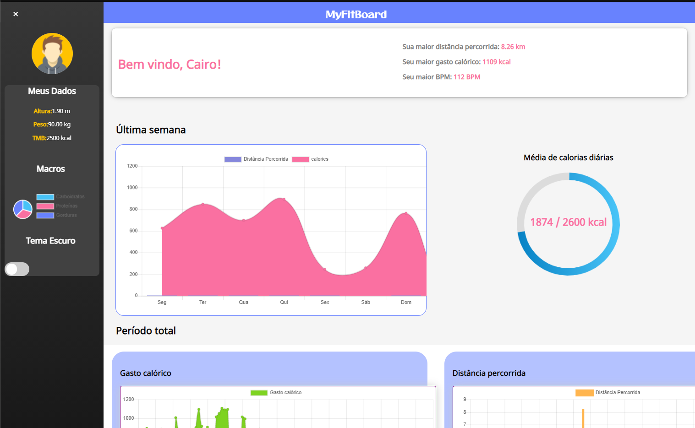

# MyFitBoard
A complete fitness monitoring dashboard created in order to agregate data fitness generated by smartwatches/smartbands or even smartphones. 



## Starting
For use MyFitBoard, you'll need **json server** instaled for iniciate a localhost to receive the data JSON. For instaling Json server, run this command:

``` 
npm install -g json-server 
```

If you had instaled, run the command to iniciate the localhost:

``` 
json-server --watch jsonExample.json
```

When you run this command, you'll can access the data API.